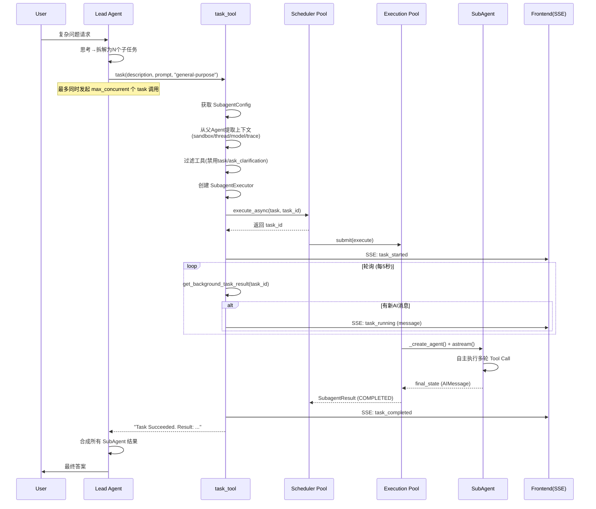

# Day 2：Agent 系统核心 — Lead Agent 与 SubAgent 深度分析

> **目标**：理解 Lead Agent + SubAgent 的设计哲学、架构模式、完整调用链路

---

## 一、整体架构概览

DeerFlow 的 Agent 系统采用 **"主编排器 + 子执行器"** 的二层架构：

```
┌─────────────────────────────────────────────────────────┐
│                      Lead Agent                         │
│  ┌──────────┐  ┌──────────┐  ┌────────────────────┐    │
│  │ 模型层   │  │ 中间件链 │  │ Prompt 模板引擎    │    │
│  │ (LLM)    │  │ (9+ MW)  │  │ (SubAgent/Skills)  │    │
│  └──────────┘  └──────────┘  └────────────────────┘    │
│                          │                              │
│              Tool Call: task(description,                │
│                 prompt, subagent_type)                   │
│                          │                              │
├──────────────────────────┼──────────────────────────────┤
│                      SubAgent 层                         │
│  ┌───────────────┐  ┌───────────────┐                   │
│  │ general-purpose│  │     bash      │                   │
│  │ (全工具继承)   │  │ (沙箱工具子集)│                   │
│  └───────────────┘  └───────────────┘                   │
│       ↑ 同一个 SubagentExecutor 引擎驱动 ↑              │
└─────────────────────────────────────────────────────────┘
```

**核心设计理念**：Lead Agent 是"指挥者"，只负责**拆解任务 + 分发 + 合成结果**；SubAgent 是"执行者"，在独立上下文中**自主完成子任务**。

---

## 二、Lead Agent 详细设计

### 2.1 入口函数：`make_lead_agent()`

完整路径：[agent.py](/Users/cooper/workload/deer-flow/backend/packages/harness/deerflow/agents/lead_agent/agent.py)

```python
def make_lead_agent(config: RunnableConfig):
```

这是 **Agent 工厂函数**，由 LangGraph 在每次请求时调用。它从 `config` 中提取运行时参数，构造并返回一个 Agent 实例。

### 2.2 配置解析层次

Lead Agent 的配置遵循 **三层优先级**（从高到低）：

```
请求参数（RunnableConfig）> Agent 配置（agents.yaml）> 全局默认（config.yaml）
```

核心配置项：

| 配置项 | 默认值 | 说明 |
|--------|--------|------|
| `thinking_enabled` | `True` | 是否启用模型思考模式（extended thinking） |
| `reasoning_effort` | `None` | 推理力度（low/medium/high） |
| `model_name` | 全局默认模型 | 可被请求级 model 参数覆盖 |
| `is_plan_mode` | `False` | 计划模式，启用 TodoList 中间件 |
| `subagent_enabled` | `False` | **核心开关**：是否启用 SubAgent 能力 |
| `max_concurrent_subagents` | `3` | 单轮最大并行 SubAgent 数 |
| `is_bootstrap` | `False` | 是否为 Bootstrap 模式（创建自定义 Agent） |

### 2.3 中间件链（Middleware Pipeline）

中间件是 LangGraph Agent 的**横切关注点**机制，执行顺序至关重要。完整的中间件链注释说明了精确的排列原因：

```
ThreadDataMiddleware → SandboxMiddleware → UploadsMiddleware
→ DanglingToolCallMiddleware → SummarizationMiddleware
→ TodoListMiddleware → TokenUsageMiddleware → TitleMiddleware
→ MemoryMiddleware → ViewImageMiddleware → DeferredToolFilterMiddleware
→ SubagentLimitMiddleware → LoopDetectionMiddleware
→ ToolErrorHandlingMiddleware → ClarificationMiddleware
```

按功能分类详解：

| 中间件 | 触发时机 | 核心作用 |
|--------|---------|---------|
| `ThreadDataMiddleware` | before_model | 注入 thread_id，确保沙箱中的数据隔离 |
| `SandboxMiddleware` | before_model | 管理沙箱环境生命周期 |
| `UploadsMiddleware` | before_model | 将用户上传文件列表注入到上下文 |
| `DanglingToolCallMiddleware` | before_model | 修复缺少 ToolMessage 的孤悬 tool_call，防止模型看到不一致的历史 |
| `SummarizationMiddleware` | after_model | 上下文过长时自动摘要，控制 token 消耗 |
| `TodoMiddleware` | before/after_model | **计划模式专用**：管理 todo list，跟踪多步骤任务进度 |
| `TokenUsageMiddleware` | after_model | 统计 token 用量，用于成本监控 |
| `TitleMiddleware` | after_model（首轮） | 根据首轮对话自动生成会话标题 |
| `MemoryMiddleware` | after_model | 分析对话、提取记忆、异步存入长期记忆 |
| `ViewImageMiddleware` | before_model | 为支持视觉的模型注入图片 base64 数据 |
| `DeferredToolFilterMiddleware` | wrap_tool_call | 隐藏延迟加载工具的 schema，减小模型上下文 |
| `SubagentLimitMiddleware` | after_model | **关键**：截断超过限制的 `task` 工具调用（硬限制 2-4） |
| `LoopDetectionMiddleware` | wrap_tool_call | 检测并打破重复工具调用死循环 |
| `ToolErrorHandlingMiddleware` | wrap_tool_call | 将工具异常转换为 ToolMessage，避免 Agent 崩溃 |
| `ClarificationMiddleware` | wrap_tool_call | **始终最后**：拦截 `ask_clarification` 调用，中断执行等待用户回复 |

### 2.4 Prompt 模板引擎

见 [prompt.py](/Users/cooper/workload/deer-flow/backend/packages/harness/deerflow/agents/lead_agent/prompt.py) 中的 `SYSTEM_PROMPT_TEMPLATE` 和 `apply_prompt_template()`。

Prompt 采用**模块化拼接**设计，包含以下可替换插槽：

```
<role> → Agent 身份定义
<soul> → 可选的自定义人格（来自 SOUL.md）
<memory> → 长期记忆上下文注入
<thinking_style> → 思考风格指导
<clarification_system> → 澄清机制规则（强制先澄清后执行）
<skill_system> → 可用 Skills 列表
<available-deferred-tools> → 延迟工具列表
<subagent_system> → SubAgent 编排指南（仅 subagent_enabled=True 时）
<working_directory> → 工作目录说明
<response_style> → 响应风格
<citations> → 引用规则
<critical_reminders> → 关键提醒
<current_date> → 当前日期
```

### 2.5 Bootstrap 模式 vs 普通模式

```python
if is_bootstrap:
    # Bootstrap: 最小化 prompt + setup_agent 工具
    # 用于首次创建自定义 Agent 的引导流程
    return create_agent(
        ...
        tools=... + [setup_agent],
        system_prompt=apply_prompt_template(..., available_skills={"bootstrap"}),
    )

# 普通模式: 完整 prompt + 全量工具
return create_agent(
    model=...,
    tools=get_available_tools(...),
    middleware=_build_middlewares(...),
    system_prompt=apply_prompt_template(...),
    state_schema=ThreadState,
)
```

Bootstrap 模式是一个**精简版 Agent**，只包含 `setup_agent` 工具，用于引导用户完成首次 Agent 配置。

---

## 三、工具构建全链路：以 `task_tool` 为例

> **目标**：理解一个 Python 函数如何通过 `@tool` 装饰器变成 LLM 可调用的工具，以及 LLM 如何通过它创建 SubAgent。

本节以 [task_tool.py](/Users/cooper/workload/deer-flow/backend/packages/harness/deerflow/tools/builtins/task_tool.py) 为案例，从装饰器 → Schema 生成 → 工具注册 → LLM 交互 → SubAgent 创建，完整走一遍链路。

### 3.1 起点：`@tool` 装饰器做了什么

```python
# task_tool.py
@tool("task", parse_docstring=True)
async def task_tool(
    runtime: ToolRuntime[ContextT, ThreadState],
    description: str,
    prompt: str,
    subagent_type: str,
    tool_call_id: Annotated[str, InjectedToolCallId],
    max_turns: int | None = None,
) -> str:
    """Delegate a task to a specialized subagent that runs in its own context.
    ...
    Args:
        description: A short (3-5 word) description...
        prompt: The task description for the subagent...
        subagent_type: The type of subagent to use...
        max_turns: Optional maximum number of agent turns...
    """
```

`@tool("task", parse_docstring=True)` 调用链路：

```
@tool("task", parse_docstring=True)
    │
    └─→ langchain_core/tools/convert.py: tool()
        │
        └─→ _create_tool_factory("task")
            │
            └─→ StructuredTool.from_function(
                    func=None,           # 异步函数用 coroutine 参数
                    coroutine=task_tool,
                    name="task",
                    infer_schema=True,   # 默认开启
                    parse_docstring=True # ← 关键！解析 docstring
                )
                │
                └─→ create_schema_from_function(
                        "task",
                        task_tool,
                        parse_docstring=True
                    )
```

`create_schema_from_function()` 做了三件事：

1. **从函数签名提取参数类型** → Pydantic Field（`description: str` → `Field(type="string")`）
2. **解析 Google-style docstring** 的 `Args:` 段落 → 每个参数的 `description`
3. **过滤注入参数**：`runtime`（`ToolRuntime`）、`tool_call_id`（`InjectedToolCallId`）等由框架注入的参数**不会**出现在生成的 Schema 中

### 3.2 生成的 Schema 长什么样

经过 `@tool` 处理后的 `task_tool` 是一个 `StructuredTool` 实例，其 `args_schema` 是一个 Pydantic Model，大致等价于：

```python
class TaskToolInput(BaseModel):
    """Delegate a task to a specialized subagent that runs in its own context.

    Subagents help you:
    - Preserve context by keeping exploration and implementation separate
    - Handle complex multi-step tasks autonomously
    ...
    """

    description: str = Field(
        description="A short (3-5 word) description of the task for logging/display."
    )
    prompt: str = Field(
        description="The task description for the subagent. Be specific and clear..."
    )
    subagent_type: str = Field(
        description="The type of subagent to use."
    )
    max_turns: int | None = Field(
        default=None,
        description="Optional maximum number of agent turns."
    )
```

`args_schema.model_json_schema()` 生成的 **JSON Schema** 就是发送给 LLM 的工具定义：

```json
{
  "name": "task",
  "description": "Delegate a task to a specialized subagent that runs in its own context.\n\nSubagents help you:\n- Preserve context by keeping exploration and implementation separate\n- Handle complex multi-step tasks autonomously\n...",
  "parameters": {
    "type": "object",
    "properties": {
      "description": {
        "type": "string",
        "description": "A short (3-5 word) description of the task..."
      },
      "prompt": {
        "type": "string",
        "description": "The task description for the subagent..."
      },
      "subagent_type": {
        "type": "string",
        "description": "The type of subagent to use."
      },
      "max_turns": {
        "type": "integer",
        "description": "Optional maximum number of agent turns."
      }
    },
    "required": ["description", "prompt", "subagent_type"]
  }
}
```

**关键点**：
- `description`（顶层）来自 docstring 的 summary 部分 → LLM 据此判断"这个工具是用来做什么的"
- `properties` 中的 `description` 来自 docstring `Args:` 段落 → LLM 据此理解每个参数的含义
- `required` 由函数签名中无默认值的参数决定
- `runtime` 和 `tool_call_id` **不出现在 Schema 中**，它们由框架在运行时注入

### 3.3 工具注册：如何进入 Agent 的工具箱

```
task_tool.py  →  builtins/__init__.py  →  tools.py  →  make_lead_agent()
                                                           │
                                              get_available_tools(subagent_enabled=True)
```

**[builtins/\_\_init\_\_.py](/Users/cooper/workload/deer-flow/backend/packages/harness/deerflow/tools/builtins/__init__.py)** 导出：

```python
from .task_tool import task_tool
```

**[tools.py](/Users/cooper/workload/deer-flow/backend/packages/harness/deerflow/tools/tools.py)** 中的注册逻辑：

```python
SUBAGENT_TOOLS = [
    task_tool,
    # task_status_tool is no longer exposed to LLM (backend handles polling internally)
]

def get_available_tools(..., subagent_enabled: bool = False) -> list[BaseTool]:
    # ...
    if subagent_enabled:
        builtin_tools.extend(SUBAGENT_TOOLS)  # ← 条件性添加
    # ...
```

**关键设计**：`task_tool` 只在 `subagent_enabled=True` 时才加入工具列表。这意味着：
- 普通模式下，Lead Agent 的工具列表**不包含** `task`，LLM 无法委托 SubAgent
- 当 `subagent_enabled=True` 时，`task` 工具出现，同时 `<subagent_system>` prompt 段也被注入

### 3.4 LLM 视角：它"看到"了什么

当 Agent 框架调用 LLM 时，工具列表被转换为 JSON Schema 放在 API 请求的 `tools` 字段中。LLM 同时收到：

**① 工具定义（JSON Schema）**：上一节生成的 JSON Schema，告知 LLM 工具名称、用途、参数

**② System Prompt（`<subagent_system>` 段落）**：引导 LLM 何时以及如何使用 `task` 工具：

```
<subagent_system>
**🚀 SUBAGENT MODE ACTIVE - DECOMPOSE, DELEGATE, SYNTHESIZE**

You are running with subagent capabilities enabled. Your role is a **task orchestrator**:
1. **DECOMPOSE**: Break complex tasks into parallel sub-tasks
2. **DELEGATE**: Launch multiple subagents simultaneously using parallel `task` calls
3. **SYNTHESIZE**: Collect and integrate results into a coherent answer

⛔ HARD CONCURRENCY LIMIT: MAXIMUM 3 `task` CALLS PER RESPONSE.
...

✅ USE Parallel Subagents when: ... (复杂研究、多维度分析、大型代码库)
❌ DO NOT use subagents when: ... (单文件读取、简单编辑、需要用户澄清)
```

**③ 对话历史**：之前的 user 消息和 assistant 回复

这三者共同构成了 LLM 的完整上下文，LLM 据此决定：
- 要不要调用 `task` 工具？
- 如果要，拆成几个子任务？
- 每个子任务的 `description` 和 `prompt` 分别是什么？

### 3.5 LLM → 框架：ToolCall 的生成与解析

当 LLM 决定使用 `task` 工具时，它返回一个 ToolCall：

```python
# LLM 返回 (在 AIMessage.tool_calls 中)
ToolCall = {
    "name": "task",
    "args": {
        "description": "分析日志文件",
        "prompt": "找出 /var/log 下所有 ERROR 级别的日志，按服务分类统计",
        "subagent_type": "general-purpose"
    },
    "id": "call_abc123",
    "type": "tool_call"
}
```

框架的解析流程：

```
                    ToolCall dict
                    {"name":"task", "args":{...}, "id":"call_abc123"}
                           │
          ┌────────────────┼────────────────┐
          │  _prep_run_args()               │
          │  tool_input  = value["args"]     │  ← 拆出 "args"
          │  tool_call_id = value["id"]      │  ← 拆出 "id"
          └────────────────┬────────────────┘
                           │
                           ▼
              tool_input = {"description": "分析日志文件",
                             "prompt": "找出 /var/log 下...",
                             "subagent_type": "general-purpose"}
                           │
          ┌────────────────┼────────────────┐
          │  _parse_input(tool_input,        │
          │               tool_call_id)      │
          │                                 │
          │  ① 检测 InjectedToolCallId       │
          │     → tool_input["tool_call_id"]  │ ← 注入 "call_abc123"
          │       = "call_abc123"            │
          │  ② args_schema.model_validate()  │ ← Pydantic 校验类型
          └────────────────┬────────────────┘
                           │
                           ▼
              tool_input = {"description": "...",
                             "prompt": "...",
                             "subagent_type": "general-purpose",
                             "tool_call_id": "call_abc123"}  ← 已注入
                           │
          ┌────────────────┼────────────────┐
          │  _to_args_and_kwargs()           │
          │  return (), tool_input           │  ← 全部作为 kwargs
          └────────────────┬────────────────┘
                           │
                           ▼
              self._run(**tool_input)
              → task_tool(description="分析日志文件",
                          prompt="找出 /var/log 下...",
                          subagent_type="general-purpose",
                          tool_call_id="call_abc123",
                          runtime=...)    ← 框架注入
```

**关键点**：
- LLM 返回的 `args` 只包含**业务参数**（`description`、`prompt`、`subagent_type`、`max_turns`）
- `tool_call_id` 从 ToolCall 的 `id` 字段提取后注入到 `tool_input` 中（对应 `InjectedToolCallId` 注解）
- `runtime` 由框架从 Agent 运行时状态构造并注入（对应 `ToolRuntime` 注解）
- `args_schema.model_validate()` 做类型校验（str 是 str 吗？必填字段都提供了吗？）

### 3.6 task_tool 内部：创建并执行 SubAgent

当 `task_tool()` 函数体开始执行时，流程如下：

```
task_tool(description, prompt, subagent_type, tool_call_id, runtime, max_turns)
    │
    ├─ 1. 获取 SubagentConfig
    │     config = get_subagent_config(subagent_type)  # general-purpose → {max_turns:100, timeout:900s, ...}
    │     若 subagent_type=="bash" 但沙箱不支持 → 返回错误
    │
    ├─ 2. 从 runtime 提取父 Agent 上下文
    │     sandbox_state = runtime.state.get("sandbox")      # 沙箱环境
    │     thread_data   = runtime.state.get("thread_data")  # 工作目录
    │     thread_id     = runtime.context.get("thread_id")  # 线程 ID
    │     parent_model  = runtime.config["metadata"]["model_name"]
    │     trace_id      = runtime.config["metadata"]["trace_id"]
    │
    ├─ 3. 获取工具列表（禁用 subagent 防止递归嵌套）
    │     from deerflow.tools import get_available_tools
    │     tools = get_available_tools(model_name=parent_model, subagent_enabled=False)
    │                                         # ↑ subagent_enabled=False → 移除 task 工具
    │
    ├─ 4. 创建 SubagentExecutor
    │     executor = SubagentExecutor(
    │         config=config,
    │         tools=tools,           # 过滤后的工具列表
    │         parent_model=...,      # 继承父模型
    │         sandbox_state=...,     # 共享沙箱
    │         thread_data=...,       # 共享工作目录
    │         thread_id=...,
    │         trace_id=...,
    │     )
    │
    ├─ 5. 异步启动 SubAgent 执行
    │     task_id = executor.execute_async(prompt, task_id=tool_call_id)
    │     # ↑ 用 tool_call_id 作为 task_id，便于追踪
    │
    ├─ 6. 轮询等待结果 + 推送 SSE 进度事件
    │     writer({"type": "task_started", ...})    # 向前端推送 "开始"
    │     while True:
    │         result = get_background_task_result(task_id)
    │         检查新消息 → writer({"type": "task_running", ...})  # 实时进度
    │         检查状态：
    │           COMPLETED → writer({"type": "task_completed", ...}) → return result
    │           FAILED/TIMED_OUT/CANCELLED → return error
    │         await asyncio.sleep(5)
    │
    └─ 7. 返回结果给 Lead Agent
          return "Task Succeeded. Result: ..."  # 作为 ToolMessage 注入对话
```

### 3.7 SubagentExecutor 内部：独立的 Agent 实例

`SubagentExecutor._create_agent()` 创建一个**全新的、独立的** Agent 实例：

```python
def _create_agent(self):
    model = create_chat_model(name=parent_model, thinking_enabled=False)
    # thinking_enabled=False：SubAgent 是执行者，无需深度推理

    return create_agent(
        model=model,
        tools=self.tools,                    # 已过滤的工具列表
        middleware=middlewares,               # 独立的中间件链
        system_prompt=self.config.system_prompt,  # SubAgent 自己的 prompt
        state_schema=ThreadState,
    )
```

`_build_initial_state()` 将任务描述包装为初始消息：

```python
def _build_initial_state(self, task):
    state = {"messages": [HumanMessage(content=task)]}
    if self.sandbox_state:
        state["sandbox"] = self.sandbox_state   # 继承父沙箱
    if self.thread_data:
        state["thread_data"] = self.thread_data # 继承工作目录
    return state
```

然后 SubAgent 在自己的上下文中**自主执行多轮 Tool Call**：
- 读取文件 → 分析 → 搜索 → 再读取 → 总结
- 所有中间推理**不污染** Lead Agent 的对话窗口
- 最终只返回结果摘要

### 3.8 完整数据流图

```mermaid
flowchart LR
    A["<b>开发者定义</b><br/>task_tool()<br/>+ docstring"]
    B["<b>JSON Schema</b><br/>工具名 / 用途描述<br/>参数名 / 参数说明"]
    C["<b>发送 LLM</b><br/>tools 字段<br/>+ 编排指南 prompt"]
    D["<b>ToolCall</b><br/>{name, args, id}"]
    E["<b>解析 &amp; 注入</b><br/>拆分 args + id<br/>注入 tool_call_id<br/>Pydantic 校验"]
    F["<b>SubAgent</b><br/>独立 Agent 实例<br/>后台多轮执行"]
    G["<b>结果返回</b><br/>摘要文本<br/>注入 Lead Agent 上下文"]

    A -->|"Schema 生成"| B
    B -->|"组装请求"| C
    C -->|"LLM 决策"| D
    D -->|"参数提取"| E
    E -->|"创建 &amp; 启动"| F
    F -->|"轮询获取"| G

    style A fill:#16213e,stroke:#e94560,color:#eee
    style B fill:#0f3460,stroke:#4a90d9,color:#eee
    style C fill:#1a1a2e,stroke:#7c3aed,color:#eee
    style D fill:#0f3460,stroke:#0ea5e9,color:#eee
    style E fill:#1a1a2e,stroke:#f59e0b,color:#eee
    style F fill:#0f3460,stroke:#10b981,color:#eee
    style G fill:#16213e,stroke:#e94560,color:#eee
```



### 3.9 关键设计要点

| 设计点 | 实现方式 | 原因 |
|--------|---------|------|
| **docstring 驱动 Schema** | `parse_docstring=True` + Google-style docstring | docstring 的 summary 成为工具描述（给 LLM 看用途），`Args:` 段落成为参数描述（给 LLM 看每个参数怎么填），无需手写 JSON Schema |
| **注入参数自动过滤** | `InjectedToolCallId`、`ToolRuntime` 标记 | 这些参数由框架注入，LLM 不需要也不能提供它们，Schema 生成时自动排除 |
| **条件性工具暴露** | `SUBAGENT_TOOLS` 仅在 `subagent_enabled=True` 时加入 | 防止普通模式下 LLM 误用 task；配合 `<subagent_system>` prompt 同步注入，确保 LLM 在正确的上下文中使用 |
| **防止递归嵌套** | SubAgent 创建时 `subagent_enabled=False` | SubAgent 的工具列表不包含 `task`，无法再创建子代理 |
| **tool_call_id 即 task_id** | `execute_async(prompt, task_id=tool_call_id)` | 将 LangChain 框架的 tool_call_id 复用为 SubAgent 的 task_id，实现端到端追踪 |
| **上下文继承与隔离** | SubAgent 继承 sandbox/thread_data，但使用独立 Agent 实例 | 共享环境（沙箱、工作目录），但隔离对话上下文（Lead Agent 看不到 SubAgent 的中间推理） |

---

## 四、SubAgent 系统详细设计

### 3.1 架构层次图

```
task_tool (LangChain Tool)
    │
    ├─ 1. 解析参数，获取 SubagentConfig
    ├─ 2. 从父 Agent 提取上下文 (sandbox/thread/model/trace)
    ├─ 3. 过滤工具（禁止嵌套 task/ask_clarification）
    ├─ 4. 创建 SubagentExecutor
    ├─ 5. execute_async() → 后台线程池启动
    └─ 6. 轮询结果 + 流式推送 progress 事件
            │
            ▼
    SubagentExecutor
        ├─ _create_agent()   → 创建独立的 LangChain Agent
        ├─ _build_initial_state() → 继承父 Agent 状态
        ├─ _aexecute()       → 异步流式执行
        ├─ execute()         → 同步包装（含事件循环隔离）
        └─ execute_async()   → 后台执行入口
```

### 3.2 核心数据结构

#### SubagentConfig（[config.py](/Users/cooper/workload/deer-flow/backend/packages/harness/deerflow/subagents/config.py)）

```python
@dataclass
class SubagentConfig:
    name: str                    # 唯一标识: "general-purpose" | "bash"
    description: str             # 给 LLM 看的用途说明
    system_prompt: str           # SubAgent 自身的 system prompt
    tools: list[str] | None      # 工具白名单，None=继承父Agent全部工具
    disallowed_tools: list[str]  # 工具黑名单，默认禁用 ["task"]
    model: str                   # 模型，"inherit" 表示使用父Agent模型
    max_turns: int               # 最大对话轮数，general-purpose=100, bash=60
    timeout_seconds: int         # 超时时间，默认 900s（15分钟）
```

#### SubagentStatus（状态机）

```python
class SubagentStatus(Enum):
    PENDING   → RUNNING → COMPLETED
                        → FAILED
                        → CANCELLED
                        → TIMED_OUT
```

#### SubagentResult（执行结果）

```python
@dataclass
class SubagentResult:
    task_id: str                 # 唯一任务ID
    trace_id: str                # 分布式追踪ID（关联父子日志）
    status: SubagentStatus       # 当前状态
    result: str | None           # 最终结果文本
    error: str | None            # 错误信息
    started_at: datetime | None
    completed_at: datetime | None
    ai_messages: list[dict]      # 执行过程中的 AI 消息（用于实时进度推送）
    cancel_event: threading.Event # 协作式取消信号
```

### 3.3 线程池三层架构

DeerFlow 为 SubAgent 执行设计了**三层线程池隔离**：

```
_scheduler_pool  (3 workers)  ← 调度层：接收 execute_async 请求
        │
        ├── submit(execution) ──→ _execution_pool (3 workers)
        │                              │  执行层：实际运行 SubAgent
        │                              │  带超时控制 (Future.result(timeout))
        │
        └── (当检测到已在事件循环中)
            ──→ _isolated_loop_pool (3 workers)
                   隔离层：在全新事件循环中执行，避免 httpx 等共享资源冲突
```

**关键设计决策：事件循环隔离**

```python
def execute(self, task, result_holder=None):
    try:
        loop = asyncio.get_running_loop()  # 检测是否已在事件循环中
    except RuntimeError:
        loop = None

    if loop is not None and loop.is_running():
        # 已在事件循环中 → 使用隔离线程池
        future = _isolated_loop_pool.submit(
            self._execute_in_isolated_loop, task, result_holder
        )
        return future.result()

    # 标准路径：无运行中的事件循环，直接 asyncio.run
    return asyncio.run(self._aexecute(task, result_holder))
```

`_execute_in_isolated_loop` 会创建**全新的事件循环**，并在 finally 中彻底清理，避免 asyncio 原语（如 httpx 客户端）与父事件循环冲突。

### 3.4 执行流程（完整时序）



### 3.5 协作式取消机制

SubAgent 不能通过 `Future.cancel()` 强制终止（线程无法被强制杀死），因此采用**协作式取消**：

```python
# 1. 设置取消信号
def request_cancel_background_task(task_id):
    result.cancel_event.set()

# 2. SubAgent 在每次 astream 迭代时检查
async for chunk in agent.astream(state, ...):
    if result.cancel_event.is_set():
        # 停止执行，标记为 CANCELLED
        result.status = SubagentStatus.CANCELLED
        return result
```

注意：取消只在 `astream` 的迭代边界生效，单个工具调用内部无法被中断。

---

## 五、两种内置 SubAgent 对比

| 维度 | general-purpose | bash |
|------|----------------|------|
| **用途** | 通用多步骤任务（研究/代码探索/文件操作/分析） | 命令行执行（git/npm/docker/build/test） |
| **工具白名单** | `None`（继承父Agent全部工具） | `["bash", "ls", "read_file", "write_file", "str_replace"]` |
| **工具黑名单** | `["task", "ask_clarification", "present_files"]` | `["task", "ask_clarification", "present_files"]` |
| **模型** | `"inherit"`（使用父Agent的模型） | `"inherit"` |
| **最大轮数** | 100 turns | 60 turns |
| **何时使用** | 需要多步推理、工具组合的复杂任务 | 需要隔离执行一系列 shell 命令 |
| **可用条件** | 始终可用 | 仅当宿主 bash 被允许时（`is_host_bash_allowed()`） |

### 工具过滤逻辑

```python
def _filter_tools(all_tools, allowed, disallowed):
    if allowed is not None:
        filtered = [t for t in filtered if t.name in allowed_set]  # 白名单优先
    if disallowed is not None:
        filtered = [t for t in filtered if t.name not in disallowed_set]  # 黑名单排除
    return filtered
```

**关键设计**：所有 SubAgent 的 `disallowed_tools` 都包含 `"task"`，**彻底防止 SubAgent 递归嵌套**，避免无限创建子代理的爆炸问题。

---

## 六、并发控制：双重保险

DeerFlow 采用 **Prompt 层 + 中间件层** 双重机制控制 SubAgent 并发数：

### 5.1 Prompt 层（软限制）

在 `<subagent_system>` 段落中明确告知 LLM：

```
⛔ HARD CONCURRENCY LIMIT: MAXIMUM 3 `task` CALLS PER RESPONSE.
- Before launching, COUNT your sub-tasks
- If count > 3: Pick the 3 most important for this turn
- Multi-batch execution for >3 sub-tasks
```

同时引导 LLM 遵循 **DECOMPOSE → COUNT → BATCH → EXECUTE → SYNTHESIZE** 的工作流。

### 5.2 中间件层（硬截断）

[SubagentLimitMiddleware](/Users/cooper/workload/deer-flow/backend/packages/harness/deerflow/agents/middlewares/subagent_limit_middleware.py) 在 `after_model` 时执行：

```python
class SubagentLimitMiddleware(AgentMiddleware):
    def _truncate_task_calls(self, state):
        # 统计所有 task 调用
        task_indices = [i for i, tc in enumerate(tool_calls)
                        if tc.get("name") == "task"]
        if len(task_indices) <= self.max_concurrent:
            return None  # 未超限，放行

        # 只保留前 max_concurrent 个，其余丢弃
        indices_to_drop = set(task_indices[self.max_concurrent:])
        truncated = [tc for i, tc in enumerate(tool_calls)
                     if i not in indices_to_drop]
        # 替换原始 AIMessage
        return {"messages": [last_msg.model_copy(
            update={"tool_calls": truncated}
        )]}
```

**并发数合法范围**：`[2, 4]`，可通过 `max_concurrent_subagents` 配置。

---

## 七、状态传递与继承

SubAgent 继承父 Agent 的关键运行时状态：

```python
# task_tool 中提取父上下文
sandbox_state = runtime.state.get("sandbox")       # 沙箱环境
thread_data  = runtime.state.get("thread_data")    # 工作目录路径
thread_id    = runtime.context.get("thread_id")    # 线程ID
parent_model = metadata.get("model_name")          # 父模型名
trace_id     = metadata.get("trace_id")            # 分布式追踪ID
```

这些状态被传递给 `SubagentExecutor`，在 `_build_initial_state()` 中注入到 SubAgent 的初始状态：

```python
def _build_initial_state(self, task):
    state = {"messages": [HumanMessage(content=task)]}
    if self.sandbox_state:
        state["sandbox"] = self.sandbox_state   # 共享沙箱
    if self.thread_data:
        state["thread_data"] = self.thread_data # 共享工作目录
    return state
```

---

## 八、Streaming 与实时反馈

`task_tool` 通过 `get_stream_writer()` 向前端推送 SSE 事件，实现 SubAgent 执行进度的实时可视化：

| SSE 事件类型 | 触发时机 | 携带数据 |
|-------------|---------|---------|
| `task_started` | SubAgent 开始执行 | `task_id`, `description` |
| `task_running` | SubAgent 产出新的 AI 消息 | `task_id`, `message`, `message_index`, `total_messages` |
| `task_completed` | SubAgent 成功完成 | `task_id`, `result` |
| `task_failed` | SubAgent 执行失败 | `task_id`, `error` |
| `task_cancelled` | SubAgent 被取消 | `task_id`, `error` |
| `task_timed_out` | SubAgent 超时 | `task_id`, `error` |

轮询间隔为 **5 秒**，每个周期检查新消息并推送增量更新。

---

## 九、关键设计决策总结

| 决策 | 方案 | 理由 |
|------|------|------|
| **为何用 SubAgent 而非直接工具调用？** | Lead Agent 通过 `task` tool 委托 SubAgent | 上下文隔离：复杂任务的中间推理不污染主对话窗口；并行执行：多个 SubAgent 可同时运行 |
| **如何防止递归嵌套？** | 所有 SubAgent 的 `disallowed_tools` 包含 `"task"` | 从工具层面彻底阻断 SubAgent 再创建 SubAgent |
| **如何控制并发？** | Prompt 软限制 + SubagentLimitMiddleware 硬截断 | 双重保险：LLM 可能不遵守 prompt 指令，中间件保证上限 |
| **为何用协作式取消？** | `threading.Event` + astream 迭代检查 | Python 线程无法被强制杀死，只能在安全的 yield 点退出 |
| **为何需要三层线程池？** | Scheduler / Execution / IsolatedLoop | 调度解耦 + 超时控制 + 事件循环隔离，防止 httpx 等异步客户端冲突 |
| **SubAgent 如何选择模型？** | `model="inherit"` 使用父 Agent 模型 | 保持推理能力一致性，也可独立指定模型 |
| **为何 SubAgent 禁用 thinking？** | `thinking_enabled=False` | SubAgent 是执行者，无需深度推理；减少 token 消耗和延迟 |

---

## 十、源码文件索引

| 文件 | 核心内容 |
|------|---------|
| [agent.py](/Users/cooper/workload/deer-flow/backend/packages/harness/deerflow/agents/lead_agent/agent.py) | `make_lead_agent()` 工厂函数、中间件链构建 |
| [prompt.py](/Users/cooper/workload/deer-flow/backend/packages/harness/deerflow/agents/lead_agent/prompt.py) | System Prompt 模板引擎、SubAgent 编排指南 |
| [task_tool.py](/Users/cooper/workload/deer-flow/backend/packages/harness/deerflow/tools/builtins/task_tool.py) | `task` 工具实现、轮询逻辑、SSE 事件推送 |
| [executor.py](/Users/cooper/workload/deer-flow/backend/packages/harness/deerflow/subagents/executor.py) | `SubagentExecutor` 核心执行引擎、线程池管理 |
| [config.py](/Users/cooper/workload/deer-flow/backend/packages/harness/deerflow/subagents/config.py) | `SubagentConfig` 数据结构定义 |
| [registry.py](/Users/cooper/workload/deer-flow/backend/packages/harness/deerflow/subagents/registry.py) | SubAgent 注册表、配置覆盖 |
| [general_purpose.py](/Users/cooper/workload/deer-flow/backend/packages/harness/deerflow/subagents/builtins/general_purpose.py) | `general-purpose` SubAgent 定义 |
| [bash_agent.py](/Users/cooper/workload/deer-flow/backend/packages/harness/deerflow/subagents/builtins/bash_agent.py) | `bash` SubAgent 定义 |
| [subagent_limit_middleware.py](/Users/cooper/workload/deer-flow/backend/packages/harness/deerflow/agents/middlewares/subagent_limit_middleware.py) | 并发数硬截断中间件 |
| [thread_state.py](/Users/cooper/workload/deer-flow/backend/packages/harness/deerflow/agents/thread_state.py) | `ThreadState` 共享状态定义 |
| [factory.py](/Users/cooper/workload/deer-flow/backend/packages/harness/deerflow/agents/factory.py) | `create_deerflow_agent()` SDK 级工厂入口 |

---

## 十一、动手实验建议

1. **开启 SubAgent 模式**：在请求参数中设置 `subagent_enabled=True`，发送一个复杂研究问题，观察 LangSmith trace 中 Lead Agent 如何拆分子任务。

2. **跟踪一次完整的 task 调用**：在 `task_tool` 的轮询循环中打断点，观察 SubAgent 的执行进度如何通过 SSE 事件推送到前端。

3. **测试并发限制**：构造一个需要 5 个以上子任务的问题，验证 `SubagentLimitMiddleware` 是否正确截断。

4. **测试取消机制**：在 SubAgent 执行期间发送取消请求，观察 `cancel_event` 如何被检查并安全退出。
